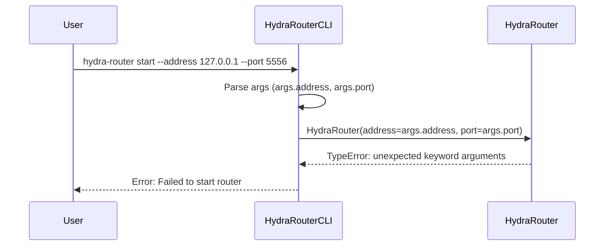

# Design Document: CLI Router Parameter Fix

## Overview

This design addresses the parameter mismatch between the CLI and HydraRouter constructor. The CLI currently passes `address` and `port` parameters, but the HydraRouter constructor expects `router_address` and `router_port`. This is a simple but critical bug that prevents the CLI from working correctly.

**Design Decision**: We will fix this by updating the CLI to use the correct parameter names that match the HydraRouter constructor signature.

## Architecture

### Current Problem



### Fixed Solution

```mermaid
sequenceDiagram
    participant User as User
    participant CLI as HydraRouterCLI
    parameter Router as HydraRouter

    User->>CLI: hydra-router start --address 127.0.0.1 --port 5556
    CLI->>CLI: Parse args (args.address, args.port)
    CLI->>Router: HydraRouter(router_address=args.address, router_port=args.port)
    Router-->>CLI: Router instance created successfully
    CLI-->>User: ✅ HydraRouter started successfully!
```

## Components and Interfaces

### HydraRouterCLI (cli.py)

**Current Implementation (Broken)**:
```python
# Line 49 in cli.py
self.router = HydraRouter(address=args.address, port=args.port)
```

**Fixed Implementation**:
```python
# Line 49 in cli.py
self.router = HydraRouter(router_address=args.address, router_port=args.port)
```

### HydraRouter Constructor Signature

**Current Signature** (from router.py lines 295-310):
```python
def __init__(
    self,
    router_address: str = RouterConstants.DEFAULT_ROUTER_ADDRESS,
    router_port: int = RouterConstants.DEFAULT_ROUTER_PORT,
    log_level: str = "INFO",
    client_timeout: float = RouterConstants.DEFAULT_CLIENT_TIMEOUT,
    max_clients: int = 100,
):
```

**No changes needed** - the constructor signature is correct.

## Data Models

### CLI Arguments Structure

The CLI arguments remain unchanged:
```python
start_parser.add_argument(
    "--address",
    default="127.0.0.1",
    help="Address to bind the router (default: 127.0.0.1)",
)
start_parser.add_argument(
    "--port", type=int, default=5556, help="Port to bind the router (default: 5556)"
)
```

### Parameter Mapping

| CLI Argument | HydraRouter Parameter | Type | Description |
|--------------|----------------------|------|-------------|
| `args.address` | `router_address` | str | Router bind address |
| `args.port` | `router_port` | int | Router bind port |

## Error Handling

### Current Error Behavior

When the parameter mismatch occurs, Python raises:
```
TypeError: HydraRouter.__init__() got unexpected keyword argument 'address'
```

### Fixed Error Behavior

After the fix, the router will initialize correctly and any errors will be related to actual runtime issues (network binding, etc.) rather than parameter mismatches.

### Validation

The fix should be validated by:
1. Ensuring the CLI can successfully create HydraRouter instances
2. Verifying that the router starts with the correct address and port
3. Confirming that error messages are related to actual runtime issues, not parameter problems

## Testing Strategy

### Unit Tests

Test the parameter mapping directly:
```python
def test_cli_parameter_mapping():
    """Test that CLI arguments map correctly to HydraRouter parameters."""
    # Mock args object
    args = argparse.Namespace(address="127.0.0.1", port=5556)

    # This should not raise TypeError
    router = HydraRouter(router_address=args.address, router_port=args.port)

    assert router.router_address == "127.0.0.1"
    assert router.router_port == 5556
```

### Integration Tests

Test the complete CLI workflow:
```python
def test_cli_router_startup():
    """Test that CLI can successfully start router with parameters."""
    # Test CLI command parsing and router creation
    # This should complete without TypeError
    pass
```

### Property-Based Tests

Since this is a simple parameter fix, property-based testing is not necessary. The fix is deterministic and can be validated with standard unit tests.

## Implementation Notes

### Files to Modify

1. **`hydra_router/cli.py`** - Line 49: Update parameter names in HydraRouter constructor call

### Backward Compatibility

This fix maintains backward compatibility because:
- The CLI interface remains the same (users still use `--address` and `--port`)
- The HydraRouter constructor signature remains unchanged
- Only the internal parameter mapping is corrected

### Risk Assessment

**Risk Level**: Very Low
- This is a simple parameter name fix
- No logic changes are required
- The change is isolated to one line of code
- Easy to test and verify

## Deployment Considerations

### Testing Before Deployment

1. Run existing unit tests to ensure no regressions
2. Test CLI startup with various address/port combinations
3. Verify router functionality after startup

### Rollback Plan

If issues arise, the change can be easily reverted by changing the parameter names back to the original (incorrect) ones, though this would reintroduce the bug.

## Future Considerations

### Parameter Naming Consistency

After this fix, we should consider:
1. Reviewing other components for similar parameter naming inconsistencies
2. Establishing naming conventions for future development
3. Adding parameter validation to catch such issues earlier

This design provides a simple, low-risk solution to fix the immediate parameter mismatch issue while maintaining system stability and backward compatibility.
