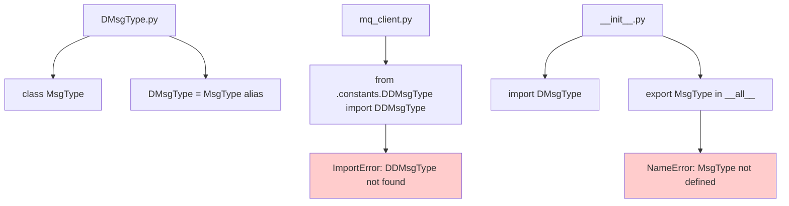
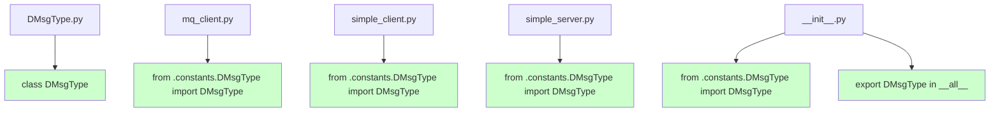

# Design Document: DMsgType Migration

## Overview

This design addresses the systematic migration from `MessageType` to `DMsgType` constants throughout the Hydra Router codebase. The migration involves correcting import statements, updating the class definition, and ensuring consistent usage patterns across all modules.

**Design Decision**: Complete the migration by updating the class name, fixing import errors, and ensuring consistent exports while maintaining all existing functionality.

## Architecture

### Current State Issues



### Target State



## Components and Interfaces

### DMsgType Constants Module

**File**: `hydra_router/constants/DMsgType.py`

**Current Implementation (Problematic)**:
```python
class MsgType(Enum):
    # ... enum values ...

# Alias for backward compatibility
DMsgType = MsgType
```

**Target Implementation**:
```python
class DMsgType(Enum):
    """Enumeration of message types for internal application use."""

    HEARTBEAT = "heartbeat"
    SQUARE_REQUEST = "square_request"
    SQUARE_RESPONSE = "square_response"
    ERROR = "error"
    CLIENT_REGISTRY_REQUEST = "client_registry_request"
    CLIENT_REGISTRY_RESPONSE = "client_registry_response"
    START_SIMULATION = "start_simulation"
    STOP_SIMULATION = "stop_simulation"
    PAUSE_SIMULATION = "pause_simulation"
    RESUME_SIMULATION = "resume_simulation"
    RESET_SIMULATION = "reset_simulation"
    GET_SIMULATION_STATUS = "get_simulation_status"
    STATUS_UPDATE = "status_update"
    SIMULATION_STARTED = "simulation_started"
    SIMULATION_STOPPED = "simulation_stopped"
    SIMULATION_PAUSED = "simulation_paused"
    SIMULATION_RESUMED = "simulation_resumed"
    SIMULATION_RESET = "simulation_reset"
```

### Import Statements

**Files to Update**:
- `hydra_router/mq_client.py`
- `hydra_router/simple_client.py`
- `hydra_router/simple_server.py`

**Current Problematic Import**:
```python
from .constants.DDMsgType import DDMsgType  # Wrong module name
```

**Target Import**:
```python
from .constants.DMsgType import DMsgType
```

### Package Exports

**File**: `hydra_router/__init__.py`

**Current Implementation (Inconsistent)**:
```python
from .constants.DMsgType import DMsgType

__all__ = [
    "DRouter",
    "MsgType",  # Wrong export name
    "MQClient",
    "HydraRouter",
    "HydraLog",
]
```

**Target Implementation**:
```python
from .constants.DMsgType import DMsgType

__all__ = [
    "DRouter",
    "DMsgType",  # Correct export name
    "MQClient",
    "HydraRouter",
    "HydraLog",
]
```

## Data Models

### Message Type Enumeration

The `DMsgType` enum maintains all existing values to ensure no breaking changes:

```python
class DMsgType(Enum):
    # Core system messages
    HEARTBEAT = "heartbeat"
    ERROR = "error"

    # Client registry
    CLIENT_REGISTRY_REQUEST = "client_registry_request"
    CLIENT_REGISTRY_RESPONSE = "client_registry_response"

    # Square operation (example)
    SQUARE_REQUEST = "square_request"
    SQUARE_RESPONSE = "square_response"

    # Simulation control
    START_SIMULATION = "start_simulation"
    STOP_SIMULATION = "stop_simulation"
    PAUSE_SIMULATION = "pause_simulation"
    RESUME_SIMULATION = "resume_simulation"
    RESET_SIMULATION = "reset_simulation"
    GET_SIMULATION_STATUS = "get_simulation_status"

    # Simulation status updates
    STATUS_UPDATE = "status_update"
    SIMULATION_STARTED = "simulation_started"
    SIMULATION_STOPPED = "simulation_stopped"
    SIMULATION_PAUSED = "simulation_paused"
    SIMULATION_RESUMED = "simulation_resumed"
    SIMULATION_RESET = "simulation_reset"
```

### Type Annotations

All type hints will be updated to use `DMsgType`:

```python
# Function parameters
def send_command(self, message_type: DMsgType, data: Dict[str, Any]) -> None:

# Class attributes
message_handlers: Dict[DMsgType, Callable]

# Return types
def _map_elem_to_message_type(self, elem: str) -> DMsgType:
```

## Correctness Properties

Now I'll analyze the acceptance criteria for testability using the prework tool:

<function_calls>
<invoke name="prework">
<parameter name="featureName">dmsgtype-migration

## Correctness Properties

*A property is a characteristic or behavior that should hold true across all valid executions of a system-essentially, a formal statement about what the system should do. Properties serve as the bridge between human-readable specifications and machine-verifiable correctness guarantees.*

### Property Reflection

After analyzing the acceptance criteria, I identified several properties that can be consolidated:

- Properties 1.2, 1.4, 1.5 can be combined into a comprehensive import validation property
- Properties 3.1, 3.2, 3.3, 3.4 can be combined into a consistent usage property
- Properties 5.1, 5.2, 5.4, 5.5 can be combined into a functional preservation property
- Properties 2.2 and 5.3 are redundant (both test enum value preservation)

### Core Properties

**Property 1: Import Statement Correctness**
*For any* Python module in the hydra_router package that imports message types, the import statement should succeed without raising ImportError or AttributeError, and should use the correct `from .constants.DMsgType import DMsgType` pattern
**Validates: Requirements 1.2, 1.4, 1.5**

**Property 2: Consistent DMsgType Usage**
*For any* reference to message types in the codebase (type hints, function parameters, variable names, message handler registrations), the reference should use `DMsgType` consistently and not contain mixed old/new naming
**Validates: Requirements 3.1, 3.2, 3.3, 3.4**

**Property 3: Enum Value Preservation**
*For any* message type enum value, the value should remain identical before and after the migration to ensure no breaking changes
**Validates: Requirements 2.2, 5.3**

**Property 4: Functional Preservation**
*For any* existing message handling operation (send, receive, register handlers), the functionality should work identically before and after the migration
**Validates: Requirements 5.1, 5.2, 5.4, 5.5**

### Example-Based Validation

The following specific examples will be validated:

- DMsgType class is properly named (not MsgType)
- No backward compatibility alias exists
- __init__.py exports DMsgType correctly
- Package allows `from hydra_router import DMsgType`
- No old MessageType or DDMsgType references remain

## Error Handling

### Import Error Prevention

The migration addresses several import-related errors:

**Current Errors**:
```python
# This fails with ImportError
from .constants.DDMsgType import DDMsgType

# This fails with NameError in __init__.py
__all__ = ["MsgType"]  # MsgType not defined
```

**Fixed Behavior**:
```python
# This succeeds
from .constants.DMsgType import DMsgType

# This succeeds
__all__ = ["DMsgType"]  # DMsgType properly imported
```

### Validation Strategy

1. **Static Analysis**: Scan codebase for old naming patterns
2. **Import Testing**: Verify all imports work correctly
3. **Functional Testing**: Ensure message handling still works
4. **Type Checking**: Verify type hints are consistent

## Testing Strategy

### Unit Tests

**Import Validation Tests**:
```python
def test_dmsgtype_import():
    """Test that DMsgType can be imported correctly."""
    from hydra_router.constants.DMsgType import DMsgType
    assert DMsgType is not None

def test_package_export():
    """Test that DMsgType is exported from main package."""
    from hydra_router import DMsgType
    assert DMsgType is not None
```

**Class Definition Tests**:
```python
def test_dmsgtype_class_name():
    """Test that the class is named DMsgType."""
    from hydra_router.constants.DMsgType import DMsgType
    assert DMsgType.__name__ == "DMsgType"

def test_no_backward_compatibility_alias():
    """Test that no MsgType alias exists."""
    from hydra_router.constants import DMsgType as module
    assert not hasattr(module, 'MsgType')
```

### Property-Based Tests

**Property Test Configuration**: Using Python's `hypothesis` library with minimum 100 iterations per test.

**Property 1: Import Statement Correctness**
```python
@given(module_name=sampled_from(['mq_client', 'simple_client', 'simple_server']))
def test_import_correctness(module_name):
    """Test that all modules can import DMsgType correctly."""
    # Test implementation validates imports work
```

**Property 2: Consistent DMsgType Usage**
```python
@given(source_code=text())
def test_consistent_usage(source_code):
    """Test that all DMsgType references are consistent."""
    # Test implementation scans for consistent naming
```

**Property 3: Enum Value Preservation**
```python
@given(enum_value=sampled_from(list(DMsgType)))
def test_enum_value_preservation(enum_value):
    """Test that enum values are preserved after migration."""
    # Test implementation compares values
```

**Property 4: Functional Preservation**
```python
@given(message_type=sampled_from(list(DMsgType)))
def test_functional_preservation(message_type):
    """Test that message handling works with DMsgType."""
    # Test implementation validates message operations
```

### Integration Tests

**End-to-End Message Flow**:
- Test complete message sending/receiving with DMsgType
- Verify message handler registration works
- Confirm client-server communication is unaffected

### Migration Validation

**Pre-Migration State Capture**:
- Record all enum values
- Document current API behavior
- Capture existing test results

**Post-Migration Validation**:
- Compare enum values (should be identical)
- Verify API behavior unchanged
- Ensure all tests still pass

## Implementation Notes

### Migration Steps

1. **Update Class Definition**: Change `class MsgType` to `class DMsgType`
2. **Remove Alias**: Delete `DMsgType = MsgType` line
3. **Fix Import Statements**: Change `DDMsgType` to `DMsgType` in all files
4. **Update Exports**: Change `MsgType` to `DMsgType` in `__all__`
5. **Validate**: Run tests to ensure everything works

### Files to Modify

1. `hydra_router/constants/DMsgType.py` - Update class name, remove alias
2. `hydra_router/mq_client.py` - Fix import statement
3. `hydra_router/simple_client.py` - Fix import statement
4. `hydra_router/simple_server.py` - Fix import statement
5. `hydra_router/__init__.py` - Update export in `__all__`

### Risk Assessment

**Risk Level**: Very Low
- Simple name changes with no logic modifications
- All enum values remain identical
- Import paths are corrected, not restructured
- Easy to test and validate

### Backward Compatibility

The migration maintains backward compatibility by:
- Preserving all enum values exactly
- Maintaining the same API surface
- Not changing any functional behavior
- Only updating internal naming consistency

## Deployment Considerations

### Testing Before Deployment

1. Run full test suite to ensure no regressions
2. Validate all imports work correctly
3. Test message sending/receiving functionality
4. Verify package exports work as expected

### Rollback Plan

If issues arise, the migration can be easily reverted by:
1. Changing class name back to `MsgType`
2. Restoring the `DMsgType = MsgType` alias
3. Reverting import statements to previous state
4. Updating exports back to `MsgType`

This design provides a systematic approach to complete the DMsgType migration while ensuring consistency, correctness, and maintaining all existing functionality.
