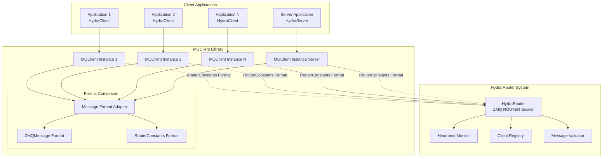
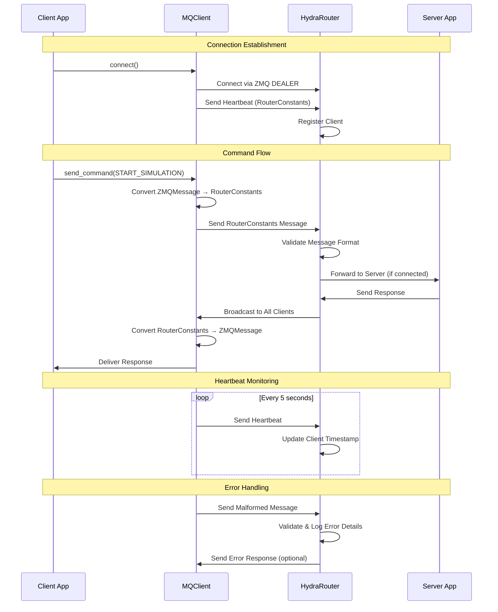
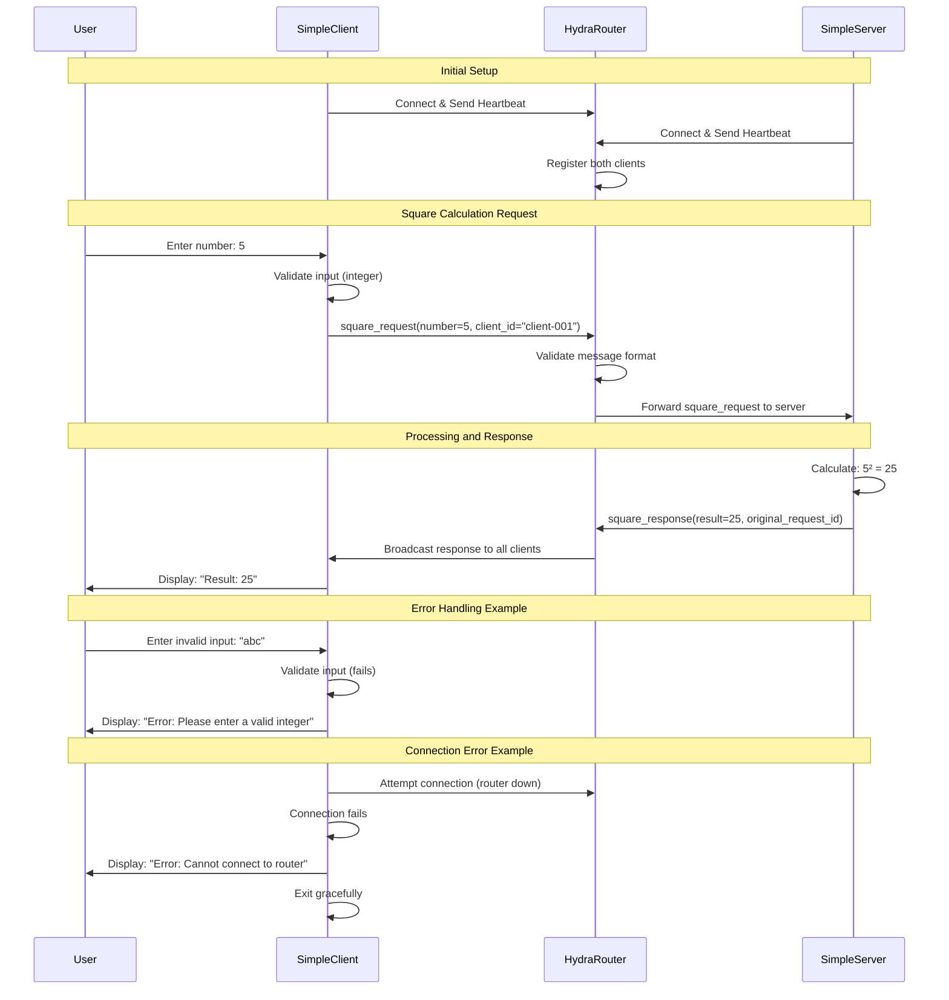

# Design Document: Hydra Router

## Overview

The Hydra Router is a reusable ZeroMQ-based message routing system. The system provides reliable communication between multiple clients and a single server through a centralized router pattern.

**Key Design Features:**
- **Standalone Component**: Generic router system that can be used by any project needing message routing
- **Message Format Conversion**: Automatic conversion between internal ZMQMessage and RouterConstants formats
- **Single Server Architecture**: Supports multiple clients with zero or one server (extensible for future multi-server support)
- **Enhanced Error Handling**: Improved validation and error reporting

## Architecture

### High-Level Architecture



### Message Flow Architecture



### Simple Client/Server Square Calculation Flow



## Components and Interfaces

### HydraRouter (Central Message Router)

**Responsibilities:**
- Accept connections from multiple clients and zero or one server
- Route messages between clients and server based on sender type
- Monitor client health through heartbeat tracking
- Validate message formats and provide detailed error logging
- Handle graceful client disconnection and cleanup

**Key Methods:**
```python
class HydraRouter:
    def __init__(self, router_address: str = "0.0.0.0", router_port: int = 5556, log_level: str = "INFO")
    async def start_background_tasks(self) -> None
    async def handle_requests(self) -> None
    async def forward_to_server(self, elem: str, data: Any, sender: bytes) -> None
    async def broadcast_to_clients(self, elem: str, data: Any, sender_id: str) -> None
    async def prune_dead_clients(self) -> None
    async def shutdown(self) -> None

    # Client registry query
    async def handle_client_registry_request(self, sender: bytes) -> None
    def get_client_registry_data(self) -> Dict[str, Dict[str, Any]]

    # Message validation and error handling
    def _validate_message_format(self, message: Dict[str, Any]) -> Tuple[bool, str]
    def _log_malformed_message(self, message: Dict[str, Any], error: str, client_identity: str) -> None
    def _log_frame_error(self, frames: List[bytes], client_identity: str) -> None
    def _log_json_parse_error(self, msg_bytes: bytes, error: Exception, client_identity: str) -> None
```

**Connection Management:**
- Uses ZeroMQ ROUTER socket for handling multiple client connections
- Maintains client registry with connection timestamps
- Supports zero or one server connection
- Automatic client pruning based on heartbeat timeouts

**Message Routing Logic:**
```python
# Client commands → Server
if sender_type == RouterConstants.HYDRA_CLIENT:
    await self.forward_to_server(elem=elem, data=data, sender=identity)

# Server responses → All Clients
elif sender_type == RouterConstants.HYDRA_SERVER:
    await self.broadcast_to_clients(elem=elem, data=data, sender_id=identity_str)
```

### MQClient (Generic Client Library)

**Responsibilities:**
- Provide unified interface for both client and server applications
- Handle automatic message format conversion between ZMQMessage and RouterConstants
- Manage connection lifecycle including heartbeat sending
- Support both synchronous and asynchronous communication patterns
- Provide comprehensive error handling and validation

**Key Methods:**
```python
class MQClient:
    def __init__(self, router_address: str, client_type: str, heartbeat_interval: float, client_id: Optional[str])
    async def connect(self) -> bool
    async def disconnect(self) -> None
    async def send_message(self, message: ZMQMessage) -> None
    async def receive_message(self) -> Optional[Dict[str, Any]]
    async def send_command(self, message_type: MessageType, data: Dict[str, Any], timeout: float) -> Optional[Dict[str, Any]]

    # Client registry query
    async def request_client_registry(self, timeout: float = 5.0) -> Optional[Dict[str, Dict[str, Any]]]

    # Format conversion methods
    def _convert_to_router_format(self, message: ZMQMessage) -> Dict[str, Any]
    def _convert_from_router_format(self, router_message: Dict[str, Any]) -> ZMQMessage
    def _map_message_type_to_elem(self, message_type: str) -> str
    def _map_elem_to_message_type(self, elem: str) -> MessageType
    def _validate_router_message(self, message: Dict[str, Any]) -> Tuple[bool, Optional[str]]

    # Heartbeat management
    async def _send_heartbeat(self) -> None
```

**Client Type Configuration:**
```python
# Example usage for different client types
hydra_client = MQClient(
    router_address="tcp://localhost:5556",
    client_type="HydraClient",
    client_id="client-001"
)

hydra_server = MQClient(
    router_address="tcp://localhost:5556",
    client_type="HydraServer",
    client_id="server-001"
)

custom_client = MQClient(
    router_address="tcp://localhost:5556",
    client_type="CustomApp",
    client_id="custom-001"
)
```

### RouterConstants (Message Format Definitions)

**Responsibilities:**
- Define standardized message format constants
- Provide client/server type definitions
- Define message structure keys and system messages
- Centralize network configuration constants

**Key Constants:**
```python
class RouterConstants:
    # Client/Server Types
    HYDRA_CLIENT = "HydraClient"
    HYDRA_SERVER = "HydraServer"
    HYDRA_ROUTER = "HydraRouter"
    SIMPLE_CLIENT = "SimpleClient"
    SIMPLE_SERVER = "SimpleServer"

    # Valid Client Types (for validation)
    VALID_CLIENT_TYPES = [
        HYDRA_CLIENT,
        HYDRA_SERVER,
        HYDRA_ROUTER,
        SIMPLE_CLIENT,
        SIMPLE_SERVER
    ]

    # Message Structure Keys
    SENDER = "sender"
    ELEM = "elem"
    DATA = "data"
    CLIENT_ID = "client_id"
    TIMESTAMP = "timestamp"
    REQUEST_ID = "request_id"

    # System Messages
    HEARTBEAT = "heartbeat"
    STATUS = "status"
    ERROR = "error"

    # Simple Client/Server Messages
    SQUARE_REQUEST = "square_request"
    SQUARE_RESPONSE = "square_response"

    # Client Registry Messages
    CLIENT_REGISTRY_REQUEST = "client_registry_request"
    CLIENT_REGISTRY_RESPONSE = "client_registry_response"

    # Simulation Control Commands
    START_SIMULATION = "start_simulation"
    STOP_SIMULATION = "stop_simulation"
    # ... additional message types

    # Configuration
    HEARTBEAT_INTERVAL = 5  # seconds
    DEFAULT_ROUTER_PORT = 5556
```

### SimpleClient (Example Client Application)

**Responsibilities:**
- Demonstrate basic MQClient usage patterns
- Accept integer input from command line
- Send square calculation requests to server
- Display results from server responses
- Handle connection errors gracefully

**Key Methods:**
```python
class SimpleClient:
    def __init__(self, router_address: str = "tcp://localhost:5556")
    async def start(self) -> None
    async def send_square_request(self, number: int) -> None
    async def handle_responses(self) -> None
    def get_user_input(self) -> Optional[int]
```

**Usage Example:**
```bash
# Start simple client
hydra-client_simple --router tcp://localhost:5556

# Interactive usage
Enter a number to square (or 'quit' to exit): 5
Sent request: 5
Received response: 25

Enter a number to square (or 'quit' to exit): 12
Sent request: 12
Received response: 144
```

### SimpleServer (Example Server Application)

**Responsibilities:**
- Demonstrate basic server-side MQClient usage
- Process square calculation requests from clients
- Send results back through the router
- Handle multiple concurrent client requests
- Demonstrate proper server lifecycle management

**Key Methods:**
```python
class SimpleServer:
    def __init__(self, router_address: str = "tcp://localhost:5556")
    async def start(self) -> None
    async def handle_requests(self) -> None
    def calculate_square(self, number: int) -> int
    async def send_response(self, result: int, request_id: str) -> None
```

**Usage Example:**
```bash
# Start simple server
hydra-server_simple --router tcp://localhost:5556

# Server output
Simple Server started, connected to router at tcp://localhost:5556
Waiting for square calculation requests...
Received request: 5 from client-001
Calculated: 5² = 25
Sent response: 25 to all clients
```

## Data Models

### Message Type Definitions

#### MessageType Enum
```python
from enum import Enum

class MessageType(Enum):
    HEARTBEAT = "heartbeat"
    SQUARE_REQUEST = "square_request"
    SQUARE_RESPONSE = "square_response"
    CLIENT_REGISTRY_REQUEST = "client_registry_request"
    CLIENT_REGISTRY_RESPONSE = "client_registry_response"
    START_SIMULATION = "start_simulation"
    STOP_SIMULATION = "stop_simulation"
    STATUS_UPDATE = "status_update"
    ERROR_OCCURRED = "error"
```

### Message Format Specifications

#### RouterConstants Format (External Communication)
```python
{
    "sender": str,          # Client type (HydraClient, HydraServer, CustomApp)
    "elem": str,            # Message type (heartbeat, start_simulation, etc.)
    "data": dict,           # Message payload
    "client_id": str,       # Unique client identifier
    "timestamp": float,     # Message timestamp
    "request_id": str       # Optional request correlation ID
}
```

#### ZMQMessage Format (Internal Application Use)
```python
@dataclass
class ZMQMessage:
    message_type: MessageType    # Enum value for message type
    timestamp: float            # Message timestamp
    client_id: Optional[str]    # Client identifier
    request_id: Optional[str]   # Request correlation ID
    data: Optional[Dict[str, Any]]  # Message payload
```

### Message Type Mapping

The MQClient handles automatic conversion between formats using the MessageType enum:

```python
from enum import Enum

class MessageType(Enum):
    HEARTBEAT = "heartbeat"
    SQUARE_REQUEST = "square_request"
    SQUARE_RESPONSE = "square_response"
    START_SIMULATION = "start_simulation"
    STOP_SIMULATION = "stop_simulation"
    STATUS_UPDATE = "status_update"
    ERROR_OCCURRED = "error"

MESSAGE_TYPE_MAPPING = {
    MessageType.HEARTBEAT.value: RouterConstants.HEARTBEAT,
    MessageType.SQUARE_REQUEST.value: RouterConstants.SQUARE_REQUEST,
    MessageType.SQUARE_RESPONSE.value: RouterConstants.SQUARE_RESPONSE,
    MessageType.CLIENT_REGISTRY_REQUEST.value: RouterConstants.CLIENT_REGISTRY_REQUEST,
    MessageType.CLIENT_REGISTRY_RESPONSE.value: RouterConstants.CLIENT_REGISTRY_RESPONSE,
    MessageType.START_SIMULATION.value: RouterConstants.START_SIMULATION,
    MessageType.STOP_SIMULATION.value: RouterConstants.STOP_SIMULATION,
    MessageType.STATUS_UPDATE.value: RouterConstants.STATUS_UPDATE,
    MessageType.ERROR_OCCURRED.value: RouterConstants.ERROR,
}
```

### Client Registry Data Model

```python
# Client tracking in HydraRouter
clients: Dict[str, Tuple[str, float]] = {}
# client_id -> (client_type, last_heartbeat_timestamp)

# Example:
{
    "HydraClient-1234": ("HydraClient", 1640995200.0),
    "HydraServer-5678": ("HydraServer", 1640995205.0),
    "CustomApp-9999": ("CustomApp", 1640995210.0)
}
```

## Error Handling and Validation

### Message Validation Pipeline

Based on the router-message-protocol-fix improvements, the HydraRouter implements comprehensive message validation:

```python
def _validate_message_format(self, message: Dict[str, Any]) -> Tuple[bool, str]:
    """Comprehensive message validation with detailed error reporting."""

    # 1. Type validation
    if not isinstance(message, dict):
        return False, f"Message must be dictionary, got {type(message).__name__}"

    # 2. Required field validation
    required_fields = [RouterConstants.SENDER, RouterConstants.ELEM]
    missing_fields = [field for field in required_fields if field not in message]
    if missing_fields:
        return False, f"Missing required fields: {', '.join(missing_fields)}"

    # 3. Field type and value validation
    sender = message.get(RouterConstants.SENDER)
    if not isinstance(sender, str) or not sender.strip():
        return False, f"Field 'sender' must be non-empty string, got: {repr(sender)}"

    elem = message.get(RouterConstants.ELEM)
    if not isinstance(elem, str) or not elem.strip():
        return False, f"Field 'elem' must be non-empty string, got: {repr(elem)}"

    # 4. Sender type validation
    if sender not in RouterConstants.VALID_CLIENT_TYPES:
        return False, f"Invalid sender type '{sender}', expected: {', '.join(RouterConstants.VALID_CLIENT_TYPES)}"

    # 5. Optional field validation
    if RouterConstants.DATA in message:
        data = message[RouterConstants.DATA]
        if not isinstance(data, (dict, type(None))):
            return False, f"Field 'data' must be dict or None, got {type(data).__name__}"

    return True, ""
```

### Enhanced Error Logging

Leveraging the detailed error logging from the existing HydraRouter implementation:

```python
def _log_malformed_message(self, message: Dict[str, Any], error: str, client_identity: str) -> None:
    """Detailed error logging for troubleshooting."""

    # Log main error
    self.logger.error(f"Malformed message from client {client_identity}: {error}")

    # Log expected vs actual format
    expected_format = {
        RouterConstants.SENDER: "string (HydraClient|HydraServer|CustomApp)",
        RouterConstants.ELEM: "string (message type)",
        RouterConstants.DATA: "dict (optional)",
        RouterConstants.CLIENT_ID: "string (optional)",
        RouterConstants.TIMESTAMP: "float (optional)",
        RouterConstants.REQUEST_ID: "string (optional)"
    }
    self.logger.error(f"Expected format: {expected_format}")

    # Log actual message (truncated for safety)
    actual_message = str(message)
    if len(actual_message) > 500:
        actual_message = actual_message[:500] + "... (truncated)"
    self.logger.error(f"Actual message: {actual_message}")

    # Provide debugging hints
    if RouterConstants.MESSAGE_TYPE in message and RouterConstants.ELEM not in message:
        self.logger.error("Detected ZMQMessage format instead of RouterConstants format")
        self.logger.error("This suggests the client is sending ZMQMessage format instead of RouterConstants format")

    # Log field analysis
    if isinstance(message, dict):
        present_fields = list(message.keys())
        self.logger.error(f"Present fields: {present_fields}")
        field_types = {k: type(v).__name__ for k, v in message.items()}
        self.logger.error(f"Field types: {field_types}")

    self.logger.error("Debugging hints: Check MQClient format conversion is working correctly")

def _log_frame_error(self, frames: List[bytes], client_identity: str) -> None:
    """Log detailed information about malformed ZMQ frames."""
    self.logger.error(f"Malformed ZMQ frames from client {client_identity}: incorrect frame count")
    self.logger.error("Expected frame structure: [identity_frame, message_frame] (2 frames total)")
    self.logger.error(f"Actual frame count: {len(frames)}")

    for i, frame in enumerate(frames):
        frame_str = str(frame)
        if len(frame_str) > 200:
            frame_str = frame_str[:200] + "... (truncated)"
        self.logger.error(f"Frame {i}: {frame_str}")

def _log_json_parse_error(self, msg_bytes: bytes, error: Exception, client_identity: str) -> None:
    """Log detailed information about JSON parsing errors."""
    self.logger.error(f"JSON parsing error from client {client_identity}: {error}")

    try:
        msg_str = msg_bytes.decode("utf-8", errors="replace")
    except Exception:
        msg_str = str(msg_bytes)

    if len(msg_str) > 300:
        msg_str = msg_str[:300] + "... (truncated)"

    self.logger.error(f"Actual message bytes: {msg_str}")
    self.logger.error(f"Message length: {len(msg_bytes)} bytes")
```

### Error Recovery Mechanisms

```python
# In MQClient - graceful error handling with format conversion
async def send_message(self, message: ZMQMessage) -> None:
    try:
        router_message = self._convert_to_router_format(message)
        await self.socket.send_json(router_message)
    except ValueError as e:
        self.logger.error(f"Format conversion failed: {e}")
        raise
    except Exception as e:
        self.logger.error(f"Unexpected error: {e}")
        raise ConnectionError(f"Failed to send message: {e}")

# In HydraRouter - continue processing despite errors
async def handle_requests(self) -> None:
    while True:
        try:
            frames = await self.socket.recv_multipart()
            identity = frames[0]
            identity_str = identity.decode()
            msg_bytes = frames[1]

            if len(frames) != 2:
                self._log_frame_error(frames, identity_str)
                continue

            try:
                msg = zmq.utils.jsonapi.loads(msg_bytes)
            except (ValueError, TypeError) as e:
                self._log_json_parse_error(msg_bytes, e, identity_str)
                continue

            # Validate message format
            validation_result = self._validate_message_format(msg)
            if not validation_result[0]:
                self._log_malformed_message(msg, validation_result[1], identity_str)
                continue

            # Process valid message
            await self._process_message(msg, identity)

        except Exception as e:
            self.logger.error(f"Router error: {e}")
            continue  # Continue processing other messages
```

## Deployment and Configuration

### Router Configuration

```python
# Command-line interface
python -m hydra_router.main --address 0.0.0.0 --port 5556 --log-level INFO

# Programmatic configuration
router = HydraRouter(
    router_address="0.0.0.0",
    router_port=5556,
    log_level="INFO"
)
```

### Client Configuration

```python
# Basic client setup
client = MQClient(
    router_address="tcp://localhost:5556",
    client_type="HydraClient",
    heartbeat_interval=5.0,
    client_id="my-client-001"
)

# Server setup
server = MQClient(
    router_address="tcp://localhost:5556",
    client_type="HydraServer",
    heartbeat_interval=5.0,
    client_id="my-server-001"
)
```

### Network Topology

```
┌─────────────────┐    ┌─────────────────┐    ┌─────────────────┐
│   Client App 1  │    │   Client App 2  │    │   Client App N  │
│   (HydraClient) │    │   (HydraClient) │    │   (CustomApp)   │
└─────────┬───────┘    └─────────┬───────┘    └─────────┬───────┘
          │                      │                      │
          │ MQClient             │ MQClient             │ MQClient
          │                      │                      │
          └──────────────────────┼──────────────────────┘
                                 │
                    ┌────────────┴────────────┐
                    │     Hydra Router        │
                    │   (ZMQ ROUTER Socket)   │
                    │     Port 5556           │
                    └────────────┬────────────┘
                                 │
                    ┌────────────┴────────────┐
                    │    Server App           │
                    │   (HydraServer)         │
                    │     MQClient            │
                    └─────────────────────────┘
```

## Correctness Properties

*A property is a characteristic or behavior that should hold true across all valid executions of a system—essentially, a formal statement about what the system should do. Properties serve as the bridge between human-readable specifications and machine-verifiable correctness guarantees.*

### Property 1: Message Format Round-Trip Conversion
*For any* valid ZMQMessage, converting to RouterConstants format and back should preserve all essential message content including type, data, timestamps, and identifiers
**Validates: Requirements 3.1, 3.2, 3.3, 3.5**

### Property 2: RouterConstants Format Compliance
*For any* message sent by MQClient to the router, the message should have the required RouterConstants format with `sender`, `elem`, `data`, `client_id`, and `timestamp` fields
**Validates: Requirements 1.1, 1.2, 2.1, 2.2**

### Property 3: Heartbeat Message Processing
*For any* valid heartbeat message in RouterConstants format, the router should process it without errors and update client tracking information
**Validates: Requirements 4.1, 4.2, 4.3, 4.4**

### Property 4: Format Validation Error Reporting
*For any* invalid message format, the Message_Validator should provide specific error details identifying missing or incorrect fields and source component information
**Validates: Requirements 5.1, 5.2, 5.5**

### Property 5: Client Connection Management
*For any* client connection lifecycle (connect, heartbeat, disconnect), the router should maintain accurate client registry state and handle connection events properly
**Validates: Requirements 4.4, 7.1, 7.2, 7.3**

### Property 6: Message Routing Correctness
*For any* valid message routing scenario (client-to-server, server-to-clients), the router should forward messages to the correct destinations based on sender type and routing rules
**Validates: Requirements 6.1, 6.2, 6.3, 6.4, 6.5**

### Property 7: Error Resilience and Recovery
*For any* format conversion failure or validation error, the system should handle it gracefully without crashing components and provide appropriate error responses
**Validates: Requirements 5.3, 5.4**

### Property 8: Concurrent Connection Handling
*For any* number of concurrent client connections (up to system limits), the router should handle all connections efficiently without performance degradation or data corruption
**Validates: Requirements 7.1, 7.2, 7.3, 7.4, 7.5**

### Property 9: Configuration Flexibility
*For any* valid configuration parameters (addresses, ports, timeouts), the system should initialize correctly and operate according to the specified settings
**Validates: Requirements 8.1, 8.2, 8.3, 8.4, 8.5**

### Property 10: Message Broadcasting Integrity
*For any* server message that should be broadcast to clients, all connected clients (except the sender) should receive the message without corruption or loss
**Validates: Requirements 6.2, 6.3**

### Property 11: Simple Client-Server Mathematical Correctness
*For any* valid integer input to the simple client, the simple server should return the mathematically correct square of that integer
**Validates: Requirements 9.2, 9.4**

### Property 12: Client Registry Query Accuracy
*For any* client registry request, the router should return accurate and current information about all connected clients including their client IDs, types, and last heartbeat timestamps
**Validates: Requirements 10.1, 10.2, 10.3**

## Testing Strategy

### Unit Tests
- Test message format conversion functions in MQClient
- Test validation logic for RouterConstants format
- Test error handling for malformed messages
- Test client registry management in HydraRouter
- Test heartbeat processing and client pruning
- Test message routing logic for different sender types

### Property-Based Tests
Using Hypothesis framework with the following configuration:
- **Minimum iterations**: 100 per property test
- **Timeout protection**: All tests include timeout decorators
- **Smart generators**: Custom generators for valid message formats and client scenarios

**Example Property Test Structure:**
```python
@given(
    message=valid_zmq_messages(),
    client_type=st.sampled_from(["HydraClient", "HydraServer", "CustomApp"])
)
@settings(max_examples=100, deadline=2000)
@pytest.mark.timeout(60)
def test_message_format_round_trip_conversion(message, client_type):
    """
    Property 1: Message Format Round-Trip Conversion
    For any valid ZMQMessage, converting to RouterConstants format and back
    should preserve all essential message content.
    """
    client = MQClient(client_type=client_type)

    # Convert to router format
    router_message = client._convert_to_router_format(message)

    # Convert back to ZMQ format
    converted_back = client._convert_from_router_format(router_message)

    # Verify essential content is preserved
    assert converted_back.message_type == message.message_type
    assert converted_back.data == message.data
    assert converted_back.timestamp == message.timestamp
    assert converted_back.client_id == message.client_id
```

**Smart Generators:**
```python
@st.composite
def valid_zmq_messages(draw):
    """Generate valid ZMQMessage instances for testing."""
    message_type = draw(st.sampled_from(list(MessageType)))
    timestamp = draw(st.floats(min_value=0, max_value=2**31))
    client_id = draw(st.text(min_size=1, max_size=50, alphabet=st.characters(whitelist_categories=('Lu', 'Ll', 'Nd'))))
    data = draw(st.dictionaries(st.text(), st.one_of(st.text(), st.integers(), st.floats())))

    return ZMQMessage(
        message_type=message_type,
        timestamp=timestamp,
        client_id=client_id,
        data=data
    )

@st.composite
def router_constants_messages(draw):
    """Generate valid RouterConstants format messages."""
    sender = draw(st.sampled_from([RouterConstants.HYDRA_CLIENT, RouterConstants.HYDRA_SERVER]))
    elem = draw(st.sampled_from([RouterConstants.HEARTBEAT, RouterConstants.START_SIMULATION, RouterConstants.STATUS]))
    data = draw(st.dictionaries(st.text(), st.one_of(st.text(), st.integers())))
    client_id = draw(st.text(min_size=1, max_size=50))
    timestamp = draw(st.floats(min_value=0, max_value=2**31))

    return {
        RouterConstants.SENDER: sender,
        RouterConstants.ELEM: elem,
        RouterConstants.DATA: data,
        RouterConstants.CLIENT_ID: client_id,
        RouterConstants.TIMESTAMP: timestamp
    }
```

### Integration Tests
- Test complete message flow between MQClient and HydraRouter
- Test multiple client connections and message broadcasting
- Test server connection/disconnection scenarios
- Test heartbeat monitoring and client pruning
- Test error recovery and retry mechanisms
- Test configuration changes and system adaptation

### Performance Tests
- Test router performance with many concurrent clients (target: 10+ clients)
- Test high thoughput values (target 1000+ messages per minute)

### End-to-End Tests
- Test complete deployment scenarios with router and multiple clients
- Test system behavior during network interruptions
- Test graceful shutdown and restart procedures
- Test configuration file loading and validation
- Test command-line interface functionality

**Performance Benchmarks:**
- **Response Time**: Message routing should complete within 10ms for normal operations
- **Throughput**: System should handle 1000+ messages per minute
- **Scalability**: Support 100+ concurrent client connections
- **Memory Usage**: Router should use less than 100MB under normal load
- **CPU Usage**: Should not exceed 50% CPU usage under normal load

## Future Extensibility

### Multi-Server Support

The current design supports zero or one server but is architected for future multi-server support:

```python
# Future routing logic for multiple servers
if sender_type == RouterConstants.HYDRA_CLIENT:
    # Route to specific server based on load balancing or message content
    target_server = self._select_target_server(elem, data)
    await self._forward_to_specific_server(target_server, elem, data, sender)

# Server-to-server communication
elif sender_type == RouterConstants.HYDRA_SERVER:
    if self._is_server_to_server_message(elem):
        await self._route_between_servers(elem, data, sender_id)
    else:
        await self.broadcast_to_clients(elem, data, sender_id)
```

### Custom Client Types

The MQClient is designed to support any client type:

```python
# Example custom client types
monitoring_client = MQClient(client_type="MonitoringAgent")
analytics_client = MQClient(client_type="AnalyticsEngine")
backup_client = MQClient(client_type="BackupService")
```

### Message Protocol Extensions

New message types can be easily added:

```python
# In RouterConstants
NEW_COMMAND = "new_command"
CUSTOM_STATUS = "custom_status"

# In MQClient MESSAGE_TYPE_MAPPING
MessageType.NEW_COMMAND.value: RouterConstants.NEW_COMMAND,
MessageType.CUSTOM_STATUS.value: RouterConstants.CUSTOM_STATUS,
```

This design provides a solid foundation for the current single-server architecture while maintaining extensibility for future enhancements.

## Command-Line Interface

The hydra-router will be available as a standalone command:

```bash
# Basic usage
hydra-router

# Custom configuration
hydra-router --address 0.0.0.0 --port 5556 --log-level INFO

# Production deployment
hydra-router --address 192.168.1.100 --port 5556 --log-level WARNING

# Help and usage information
hydra-router --help
```

**Command-Line Arguments:**
- `--address, -a`: IP address to bind router to (default: 0.0.0.0)
- `--port, -p`: Port to bind router to (default: 5556)
- `--log-level`: Logging level (DEBUG, INFO, WARNING, ERROR, default: INFO)
- `--help, -h`: Show help message and exit

## Package Structure

The hydra-router is a standalone PyPI package:

```
hydra_router/
├── __init__.py
├── router.py              # HydraRouter implementation
├── mq_client.py           # MQClient implementation
├── router_constants.py    # RouterConstants definitions
├── simple_client.py       # SimpleClient implementation
├── simple_server.py       # SimpleServer implementation
├── cli.py                 # Command-line interface
└── exceptions.py          # Custom exceptions
```

**Entry Point Configuration (pyproject.toml):**
```toml
[project.scripts]
hydra-router = "hydra_router.router:main"
hydra-client_simple = "hydra_router.simple_client:main"
hydra-server_simple = "hydra_router.simple_server:main"
```

## Deployment Examples

### Simple Client/Server Demo
```bash
# Terminal 1: Start the router
hydra-router --log-level DEBUG

# Terminal 2: Start the simple server
hydra-server_simple --router tcp://localhost:5556

# Terminal 3: Start the simple client
hydra-client_simple --router tcp://localhost:5556
# Then enter numbers to see their squares calculated by the server
```

### Local Development
```bash
# Terminal 1: Start the router
hydra-router --log-level DEBUG

# Terminal 2: Start a server application
python my_server.py --router tcp://localhost:5556

# Terminal 3: Start client applications
python my_client1.py --router tcp://localhost:5556
python my_client2.py --router tcp://localhost:5556
```

### Production Environment
```bash
# Start router on production server
hydra-router --address 0.0.0.0 --port 5556 --log-level WARNING

# Connect clients from different machines
python client_app.py --router tcp://production-server:5556
```

### Docker Deployment
```dockerfile
FROM python:3.11-slim

RUN pip install hydra-router

EXPOSE 5556

CMD ["hydra-router", "--address", "0.0.0.0", "--port", "5556"]
```

## Migration Path

For projects that want to integrate the hydra-router:

1. **Install Package**: `pip install hydra-router`
2. **Start Router**: Use command-line interface to start router
3. **Integrate Clients**: Use MQClient library in your applications
4. **Test Integration**: Verify message routing works correctly
5. **Deploy**: Roll out router and client applications

**Client Code Example:**
```python
from hydra_router.mq_client import MQClient

# Simple client setup
client = MQClient(
    router_address="tcp://localhost:5556",
    client_type="MyCustomClient"
)
```
