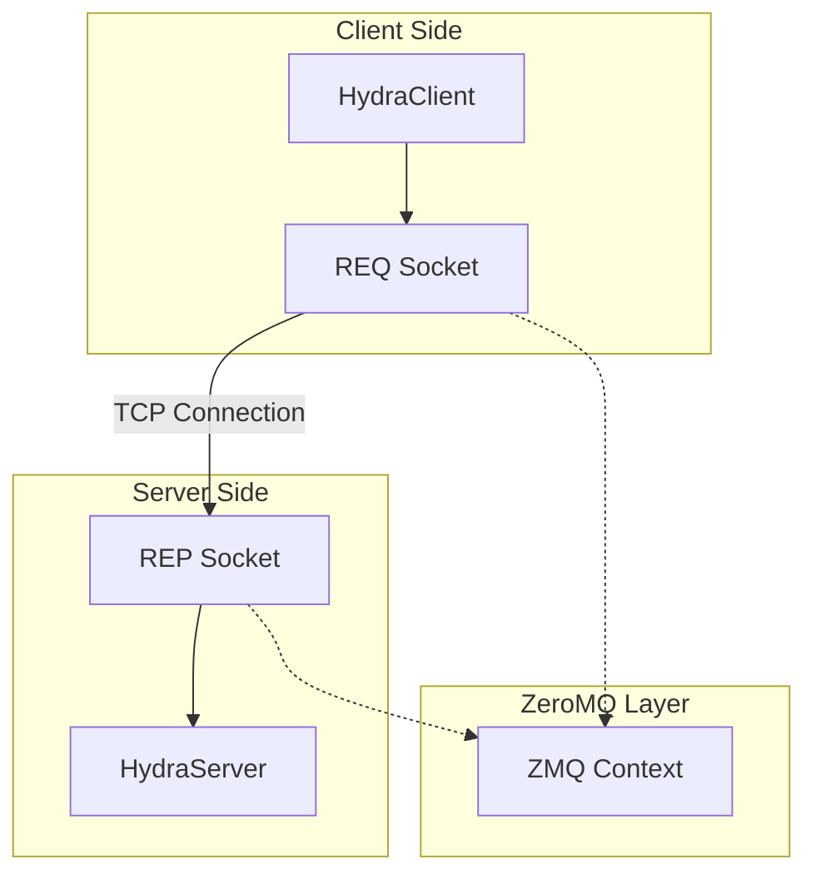

# Design Document: Hydra Router

## Overview

The Hydra Router system provides a foundational ZeroMQ-based client-server communication framework. This initial implementation establishes the core architecture with HydraServer and HydraClient classes that implement basic REQ/REP messaging patterns. The design emphasizes clean class organization, proper resource management, and extensibility for future enhancements.

## Architecture

The system follows a simple client-server architecture using ZeroMQ's REQ/REP pattern:



## Components and Interfaces

### HydraServer Class

**Location:** `hydra_router/server/HydraServer.py`

**Responsibilities:**
- Bind to TCP address and port
- Listen for incoming client requests
- Process and respond to messages
- Manage ZeroMQ REP socket lifecycle

**Key Methods:**
- `__init__(address: str = "*", port: int = 5555)`: Initialize server with binding parameters
- `start()`: Begin listening for requests in a simple loop
- Basic message handling that echoes or responds to requests

**Socket Management:**
- Simple ZeroMQ context and REP socket creation
- Basic bind to `tcp://{address}:{port}`
- Minimal cleanup

### HydraClient Class

**Location:** `hydra_router/client/HydraClient.py`

**Responsibilities:**
- Connect to server endpoint
- Send requests and receive responses
- Manage ZeroMQ REQ socket lifecycle

**Key Methods:**
- `__init__(server_address: str = "tcp://localhost:5555")`: Initialize client with server endpoint
- `send_message(message: bytes) -> bytes`: Send request and wait for response
- Simple connection and messaging

**Socket Management:**
- Simple ZeroMQ context and REQ socket creation
- Basic connect to server address
- Minimal cleanup

## Data Models

### Message Format

For this initial implementation, messages are handled as raw bytes:

```python
# Simple byte message format
message: bytes = b"Hello"
response: bytes = b"World"
```

### Configuration Parameters

```python
# Server Configuration
server_config = {
    "address": str,  # Binding address (default: "*")
    "port": int,     # Binding port (default: 5555)
}

# Client Configuration
client_config = {
    "server_address": str,  # Server endpoint (default: "tcp://localhost:5555")
}
```

## Correctness Properties

*A property is a characteristic or behavior that should hold true across all valid executions of a system-essentially, a formal statement about what the system should do. Properties serve as the bridge between human-readable specifications and machine-verifiable correctness guarantees.*

Based on the prework analysis, the following properties validate the core functionality:

### Property 1: Request-Response Round Trip
*For any* valid message sent by a HydraClient to a HydraServer, the client should receive a response from the server
**Validates: Requirements 1.2, 1.4, 2.2, 2.3**

### Property 2: Server Binding Configuration
*For any* valid address and port combination, a HydraServer should successfully bind to that address and port
**Validates: Requirements 1.1, 1.6**

### Property 3: Client Connection Configuration
*For any* valid server address, a HydraClient should successfully connect to that server address
**Validates: Requirements 2.1, 2.5**

### Property 4: Multiple Sequential Requests
*For any* sequence of messages sent by a HydraClient, all messages should receive responses in the correct order
**Validates: Requirements 2.6**

### Property 5: ZeroMQ Socket Configuration
*For any* HydraServer and HydraClient instance, the server should use REP socket type and the client should use REQ socket type with proper context initialization
**Validates: Requirements 3.1, 3.2, 3.3**

### Property 6: Resource Cleanup
*For any* HydraServer or HydraClient instance, after shutdown/disconnect, all ZeroMQ resources should be properly closed
**Validates: Requirements 3.4**

### Property 7: Message Logging
*For any* message sent or received, appropriate log entries should be created with the message details
**Validates: Requirements 1.3, 2.4, 5.2, 5.3, 5.4**

### Property 8: Startup Logging
*For any* HydraServer instance, when started, a log entry should be created indicating the binding address and port
**Validates: Requirements 5.1**

### Property 9: Error Handling and Logging
*For any* error condition that occurs, appropriate error log entries should be created with sufficient detail
**Validates: Requirements 3.5, 5.5**

## Error Handling

The system implements minimal error handling following the example code style:

### Connection Errors
- Server binding failures (port already in use, invalid address)
- Client connection failures (server not available, invalid address)

### Error Response Strategy
- Print exceptions and exit on error conditions
- Minimal error handling, following the simple example code pattern

## Testing Strategy

The testing approach combines unit tests for specific scenarios with property-based tests for comprehensive validation:

### Unit Testing
- Test specific initialization scenarios with known parameters
- Test error conditions with invalid inputs
- Test resource cleanup in normal and error scenarios
- Test logging output with specific message examples

### Property-Based Testing
- Use **Hypothesis** for Python property-based testing
- Configure each property test to run minimum 100 iterations
- Test universal properties across randomly generated inputs
- Each property test references its design document property

**Property Test Configuration:**
- Framework: Hypothesis for Python
- Iterations: Minimum 100 per property test
- Tag format: **Feature: hydra-router, Property {number}: {property_text}**

### Integration Testing
- Test complete client-server communication flows
- Test multiple concurrent clients (future enhancement)
- Test long-running server scenarios
- Test network failure recovery scenarios

The dual testing approach ensures both specific edge cases are covered (unit tests) and general correctness is validated across all possible inputs (property tests).
