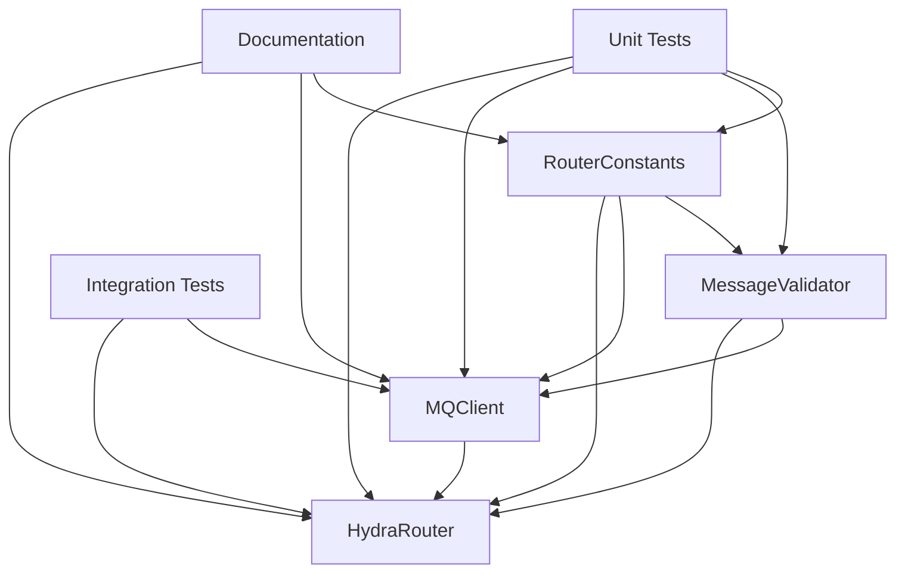

# Implementation Tasks: Hydra Router

## Overview

This document outlines the implementation tasks for extracting the router functionality from the AI Hydra project as a standalone Hydra Router component. The implementation will create a reusable ZeroMQ-based message routing system with a generic MQClient library.

## Task Categories

### Phase 1: Core Infrastructure Setup
- **Duration**: 1-2 days
- **Dependencies**: None
- **Deliverables**: Project structure, basic configuration, testing framework

### Phase 2: Message Format and Constants
- **Duration**: 1 day  
- **Dependencies**: Phase 1
- **Deliverables**: RouterConstants module, message validation

### Phase 3: MQClient Library Implementation
- **Duration**: 2-3 days
- **Dependencies**: Phase 2
- **Deliverables**: Generic MQClient with format conversion

### Phase 4: HydraRouter Core Implementation
- **Duration**: 2-3 days
- **Dependencies**: Phase 3
- **Deliverables**: Central router with message routing logic

### Phase 5: Integration and Testing
- **Duration**: 2-3 days
- **Dependencies**: Phase 4
- **Deliverables**: Comprehensive test suite, integration validation

### Phase 6: Documentation and Deployment
- **Duration**: 1-2 days
- **Dependencies**: Phase 5
- **Deliverables**: API documentation, deployment guides

## Detailed Task Breakdown

### Phase 1: Core Infrastructure Setup

#### Task 1.1: Create Standalone PyPI Package Structure
**Priority**: High  
**Estimated Time**: 2 hours  
**Assignee**: Developer  

**Description**: Set up the standalone hydra-router PyPI package structure that will provide the `hydra-router` executable.

**Acceptance Criteria**:
- [x] Create `hydra_router/` package directory as standalone project
- [x] Set up `pyproject.toml` with PyPI package metadata and `hydra-router` console script entry point
- [x] Configure package to be installable via `pip install hydra-router`
- [x] Create `README.md` with PyPI package overview and installation instructions
- [x] Set up `tests/` directory structure following testing standards
- [x] Configure `.gitignore` for Python projects
- [x] Create `examples/` directory for usage examples

**Implementation Details**:
```
hydra-router/                    # Standalone PyPI package
├── src/
│   └── hydra_router/
│       ├── __init__.py
│       ├── router.py
│       ├── mq_client.py
│       ├── router_constants.py
│       ├── exceptions.py
│       └── cli.py
├── tests/
│   ├── unit/
│   ├── property/
│   ├── integration/
│   └── conftest.py
├── examples/
├── docs/
├── pyproject.toml              # PyPI package configuration
├── README.md                   # PyPI package documentation
├── LICENSE
└── .gitignore
```

**PyPI Configuration**:
```toml
[project.scripts]
hydra-router = "hydra_router.cli:main"
```

**Dependencies**: ZeroMQ, asyncio, pytest, hypothesis

#### Task 1.2: Configure Development Environment
**Priority**: High  
**Estimated Time**: 1 hour  
**Assignee**: Developer  

**Description**: Set up development tools and CI/CD configuration.

**Acceptance Criteria**:
- [ ] Configure Black code formatter
- [ ] Configure pytest with coverage reporting
- [ ] Set up pre-commit hooks
- [ ] Configure GitHub Actions for CI/CD
- [ ] Set up logging configuration

**Files to Create**:
- `.pre-commit-config.yaml`
- `.github/workflows/test.yml`
- `pyproject.toml` (tool configurations)

### Phase 2: Message Format and Constants

#### Task 2.1: Extract RouterConstants Module
**Priority**: High  
**Estimated Time**: 2 hours  
**Assignee**: Developer  

**Description**: Create a comprehensive RouterConstants module with standardized message format definitions and client type constants.

**Acceptance Criteria**:
- [ ] Create `RouterConstants` class with all required constants
- [ ] Add comprehensive message type constants
- [ ] Add client type definitions including VALID_CLIENT_TYPES list
- [ ] Add network configuration constants
- [ ] Add validation constants and error messages
- [ ] Include comprehensive documentation

**Target File**: `hydra_router/router_constants.py`

**Implementation Notes**:
- Maintain backward compatibility with existing message types
- Add extensibility for future message types
- Include comprehensive documentation

#### Task 2.2: Create Message Validation Framework
**Priority**: High  
**Estimated Time**: 3 hours  
**Assignee**: Developer  

**Description**: Implement comprehensive message validation with detailed error reporting.

**Acceptance Criteria**:
- [ ] Create `MessageValidator` class
- [ ] Implement RouterConstants format validation
- [ ] Add detailed error reporting with context
- [ ] Create validation helper functions
- [ ] Add performance-optimized validation paths

**Target File**: `hydra_router/validation.py`

**Key Methods**:
```python
class MessageValidator:
    def validate_router_message(self, message: Dict[str, Any]) -> Tuple[bool, str]
    def validate_field_types(self, message: Dict[str, Any]) -> Tuple[bool, str]
    def validate_sender_type(self, sender: str) -> bool
    def get_validation_error_details(self, message: Dict[str, Any]) -> str
```

#### Task 2.3: Define Custom Exceptions
**Priority**: Medium  
**Estimated Time**: 1 hour  
**Assignee**: Developer  

**Description**: Create custom exception hierarchy for router-specific errors.

**Acceptance Criteria**:
- [ ] Create base `HydraRouterError` exception
- [ ] Create `MessageValidationError` for format issues
- [ ] Create `ConnectionError` for network issues
- [ ] Create `ClientRegistrationError` for client management issues
- [ ] Add error context and debugging information

**Target File**: `hydra_router/exceptions.py`

### Phase 3: MQClient Library Implementation

#### Task 3.1: Extract and Enhance MQClient Core
**Priority**: High  
**Estimated Time**: 4 hours  
**Assignee**: Developer  

**Description**: Implement a generic, reusable MQClient library that handles router communication and message format conversion.

**Acceptance Criteria**:
- [ ] Create MQClient class with unified interface for client and server applications
- [ ] Implement automatic message format conversion between ZMQMessage and RouterConstants
- [ ] Enhance configurability for different client types
- [ ] Add comprehensive error handling and logging
- [ ] Implement graceful connection management
- [ ] Add support for both synchronous and asynchronous communication patterns

**Target File**: `hydra_router/mq_client.py`

**Key Enhancements**:
- Generic client type configuration
- Improved error handling and logging
- Better connection lifecycle management
- Enhanced message validation

#### Task 3.2: Implement Message Format Conversion
**Priority**: High  
**Estimated Time**: 3 hours  
**Assignee**: Developer  

**Description**: Implement robust message format conversion between ZMQMessage and RouterConstants formats.

**Acceptance Criteria**:
- [ ] Create `MessageFormatAdapter` class
- [ ] Implement ZMQMessage → RouterConstants conversion
- [ ] Implement RouterConstants → ZMQMessage conversion
- [ ] Add comprehensive validation for both formats
- [ ] Handle conversion errors gracefully
- [ ] Preserve all message metadata during conversion

**Key Methods**:
```python
class MessageFormatAdapter:
    def convert_to_router_format(self, message: ZMQMessage) -> Dict[str, Any]
    def convert_from_router_format(self, router_message: Dict[str, Any]) -> ZMQMessage
    def validate_conversion(self, original: Any, converted: Any) -> bool
```

#### Task 3.3: Implement Heartbeat Management
**Priority**: High  
**Estimated Time**: 2 hours  
**Assignee**: Developer  

**Description**: Implement robust heartbeat mechanism for client health monitoring.

**Acceptance Criteria**:
- [ ] Create `HeartbeatManager` class
- [ ] Implement periodic heartbeat sending
- [ ] Add configurable heartbeat intervals
- [ ] Handle heartbeat failures gracefully
- [ ] Provide heartbeat status monitoring

**Key Features**:
- Automatic heartbeat scheduling
- Connection health monitoring
- Graceful error recovery
- Configurable timing parameters

#### Task 3.4: Add Asynchronous Communication Patterns
**Priority**: Medium  
**Estimated Time**: 3 hours  
**Assignee**: Developer  

**Description**: Implement comprehensive asynchronous communication patterns for the MQClient.

**Acceptance Criteria**:
- [ ] Implement async message sending with error handling
- [ ] Add non-blocking message receiving
- [ ] Implement command/response patterns with timeouts
- [ ] Add message correlation for request/response matching
- [ ] Handle concurrent operations safely

**Key Methods**:
```python
async def send_message(self, message: ZMQMessage) -> None
async def receive_message(self) -> Optional[Dict[str, Any]]
async def send_command(self, message_type: MessageType, data: Dict[str, Any], timeout: float) -> Optional[Dict[str, Any]]
```

### Phase 4: HydraRouter Core Implementation

#### Task 4.1: Extract and Enhance HydraRouter Core
**Priority**: High  
**Estimated Time**: 4 hours  
**Assignee**: Developer  

**Description**: Implement the central HydraRouter component that manages client connections and routes messages between clients and servers.

**Acceptance Criteria**:
- [ ] Create HydraRouter class with ZeroMQ ROUTER socket handling
- [ ] Implement message routing logic between clients and servers
- [ ] Add comprehensive message validation and error handling
- [ ] Implement client registry management and heartbeat monitoring
- [ ] Add graceful shutdown procedures and resource cleanup
- [ ] Include detailed error logging and debugging capabilities

**Target File**: `hydra_router/router.py`

**Key Enhancements**:
- Generic client type support
- Enhanced error logging with context
- Improved connection management
- Better resource cleanup

#### Task 4.2: Implement Client Registry Management
**Priority**: High  
**Estimated Time**: 3 hours  
**Assignee**: Developer  

**Description**: Implement robust client registry for tracking connected clients and servers.

**Acceptance Criteria**:
- [ ] Create `ClientRegistry` class
- [ ] Implement thread-safe client tracking
- [ ] Add client type classification
- [ ] Implement automatic client pruning
- [ ] Provide client statistics and monitoring

**Key Methods**:
```python
class ClientRegistry:
    def register_client(self, client_id: str, client_type: str) -> None
    def update_heartbeat(self, client_id: str) -> None
    def remove_client(self, client_id: str) -> None
    def get_clients_by_type(self, client_type: str) -> List[str]
    def prune_inactive_clients(self, timeout: float) -> List[str]
```

#### Task 4.3: Implement Message Routing Logic
**Priority**: High  
**Estimated Time**: 3 hours  
**Assignee**: Developer  

**Description**: Implement comprehensive message routing between clients and servers.

**Acceptance Criteria**:
- [ ] Create `MessageRouter` class
- [ ] Implement client → server message forwarding
- [ ] Implement server → clients message broadcasting
- [ ] Add message filtering capabilities
- [ ] Handle routing errors gracefully
- [ ] Support extensible routing rules

**Key Features**:
- Client command forwarding to server
- Server response broadcasting to clients
- Message filtering based on client type
- Error handling for missing destinations
- Logging for routing decisions

#### Task 4.4: Add Background Task Management
**Priority**: Medium  
**Estimated Time**: 2 hours  
**Assignee**: Developer  

**Description**: Implement background task management for router operations.

**Acceptance Criteria**:
- [ ] Create `BackgroundTaskManager` class
- [ ] Implement client pruning task
- [ ] Add health monitoring task
- [ ] Handle task lifecycle management
- [ ] Provide task status monitoring

**Background Tasks**:
- Client heartbeat monitoring and pruning
- Connection health checks
- Performance metrics collection
- Resource cleanup

### Phase 5: Integration and Testing

#### Task 5.1: Create Unit Test Suite
**Priority**: High  
**Estimated Time**: 6 hours  
**Assignee**: Developer  

**Description**: Implement comprehensive unit tests for all components.

**Acceptance Criteria**:
- [ ] Test RouterConstants and validation functions
- [ ] Test MQClient message format conversion
- [ ] Test HydraRouter routing logic
- [ ] Test error handling and edge cases
- [ ] Achieve 90%+ code coverage

**Test Files**:
- `tests/unit/test_router_constants.py`
- `tests/unit/test_mq_client.py`
- `tests/unit/test_router.py`
- `tests/unit/test_validation.py`
- `tests/unit/test_exceptions.py`

#### Task 5.2: Create Property-Based Tests
**Priority**: High  
**Estimated Time**: 4 hours  
**Assignee**: Developer  

**Description**: Implement property-based tests for universal behavior validation.

**Acceptance Criteria**:
- [ ] Test message format conversion round-trip properties
- [ ] Test client registry management properties
- [ ] Test routing logic properties
- [ ] Test error handling properties
- [ ] Reference requirements in test documentation

**Test Files**:
- `tests/property/test_message_conversion_properties.py`
- `tests/property/test_client_management_properties.py`
- `tests/property/test_routing_properties.py`
- `tests/property/test_simple_client_server_properties.py`

**Key Properties to Test**:
```python
# Property 1: Message Format Conversion Round-Trip
# For any valid ZMQMessage, convert to RouterConstants and back should be identity

# Property 2: Client Registry Consistency  
# For any sequence of client operations, registry state should remain consistent

# Property 3: Message Routing Reliability
# For any valid message and connected clients, routing should succeed or fail gracefully

# Property 11: Simple Client-Server Mathematical Correctness
# For any valid integer, simple server should return correct square calculation
```

#### Task 5.3: Create Integration Tests
**Priority**: High  
**Estimated Time**: 4 hours  
**Assignee**: Developer  

**Description**: Implement integration tests for component interactions.

**Acceptance Criteria**:
- [ ] Test MQClient ↔ HydraRouter communication
- [ ] Test multiple client scenarios
- [ ] Test server connection/disconnection
- [ ] Test error recovery scenarios
- [ ] Test performance under load

**Test Files**:
- `tests/integration/test_client_router_integration.py`
- `tests/integration/test_multi_client_scenarios.py`
- `tests/integration/test_server_lifecycle.py`

#### Task 5.4: Create End-to-End Tests
**Priority**: Medium  
**Estimated Time**: 3 hours  
**Assignee**: Developer  

**Description**: Implement end-to-end tests for complete workflows.

**Acceptance Criteria**:
- [ ] Test complete client-server communication workflow
- [ ] Test router startup and shutdown procedures
- [ ] Test error scenarios and recovery
- [ ] Test configuration and deployment scenarios

**Test Files**:
- `tests/e2e/test_complete_workflow.py`
- `tests/e2e/test_deployment_scenarios.py`

### Phase 6: Documentation and Deployment

#### Task 6.1: Create API Documentation
**Priority**: High  
**Estimated Time**: 4 hours  
**Assignee**: Developer  

**Description**: Create comprehensive API documentation using Sphinx.

**Acceptance Criteria**:
- [ ] Set up Sphinx documentation framework
- [ ] Document all public APIs with examples
- [ ] Create architecture overview documentation
- [ ] Add usage examples and tutorials
- [ ] Generate HTML documentation

**Documentation Structure**:
```
docs/
├── source/
│   ├── api_reference.rst
│   ├── getting_started.rst
│   ├── architecture.rst
│   ├── examples.rst
│   └── troubleshooting.rst
├── Makefile
└── requirements.txt
```

#### Task 6.2: Create Usage Examples
**Priority**: High  
**Estimated Time**: 3 hours  
**Assignee**: Developer  

**Description**: Create comprehensive usage examples for different scenarios.

**Acceptance Criteria**:
- [ ] Basic client-server communication example
- [ ] Multiple client types example
- [ ] Custom client implementation example
- [ ] Error handling and recovery example
- [ ] Configuration and deployment example
- [ ] Simple client/server square calculation walkthrough

**Example Files**:
- `examples/basic_client_server.py`
- `examples/multiple_clients.py`
- `examples/custom_client_type.py`
- `examples/error_handling.py`
- `examples/configuration_example.py`
- `examples/simple_square_demo.py`

#### Task 6.3: Create Command-Line Interface
**Priority**: Medium  
**Estimated Time**: 2 hours  
**Assignee**: Developer  

**Description**: Create CLI for router deployment and management.

**Acceptance Criteria**:
- [ ] Implement router startup command
- [ ] Add configuration options
- [ ] Add logging level control
- [ ] Provide status monitoring commands
- [ ] Add help and usage information

**Target File**: `hydra_router/cli.py`

**CLI Commands**:
```bash
hydra-router start --address 0.0.0.0 --port 5556 --log-level INFO
hydra-router status --router-address tcp://localhost:5556
hydra-router --help
```

#### Task 6.4: Create Simple Client and Server Examples
**Priority**: High  
**Estimated Time**: 3 hours  
**Assignee**: Developer  

**Description**: Create simple client and server applications that demonstrate basic hydra-router usage with integer square calculation.

**Acceptance Criteria**:
- [ ] Create `SimpleClient` class that accepts integer input from command line
- [ ] Implement square request sending using MQClient
- [ ] Create `SimpleServer` class that processes square calculation requests
- [ ] Implement response broadcasting to all connected clients
- [ ] Add proper error handling and connection management
- [ ] Create command-line entry points for both applications
- [ ] Add comprehensive logging and user feedback

**Target Files**:
- `hydra_router/simple_client.py`
- `hydra_router/simple_server.py`

**Key Features**:
- Interactive command-line interface for client
- Automatic connection management
- Proper message formatting using RouterConstants
- Error handling for invalid inputs and connection issues
- Graceful shutdown on user request

#### Task 6.5: Create Deployment Documentation
#### Task 6.5: Create Deployment Documentation
**Priority**: Medium  
**Estimated Time**: 2 hours  
**Assignee**: Developer  

**Description**: Create deployment and operational documentation.

**Acceptance Criteria**:
- [ ] Installation instructions
- [ ] Configuration guide
- [ ] Deployment scenarios documentation
- [ ] Troubleshooting guide
- [ ] Performance tuning guide
- [ ] Simple client/server usage examples

**Documentation Files**:
- `docs/source/installation.rst`
- `docs/source/configuration.rst`
- `docs/source/deployment.rst`
- `docs/source/troubleshooting.rst`
- `docs/source/examples.rst`

## Implementation Dependencies

### External Dependencies
- **ZeroMQ (pyzmq)**: Core messaging library
- **asyncio**: Asynchronous programming support
- **pytest**: Testing framework
- **hypothesis**: Property-based testing
- **sphinx**: Documentation generation
- **black**: Code formatting
- **mypy**: Type checking

### Internal Dependencies


## Testing Strategy

### Test Coverage Requirements
- **Unit Tests**: 95% line coverage for core components
- **Property Tests**: 100% coverage of testable acceptance criteria
- **Integration Tests**: All component interaction scenarios
- **End-to-End Tests**: Complete workflow validation

### Test Execution Strategy
```bash
# Fast tests for development
pytest tests/unit/ -v

# Property-based tests
pytest tests/property/ --max-examples=100

# Integration tests
pytest tests/integration/ -v

# Full test suite
pytest tests/ --cov=hydra_router --cov-report=html
```

### Performance Testing
- **Message Throughput**: Test with 100+ concurrent clients
- **Memory Usage**: Monitor memory consumption under load
- **Connection Handling**: Test rapid connect/disconnect scenarios
- **Error Recovery**: Test recovery from various failure modes

## Risk Assessment and Mitigation

### High-Risk Areas
1. **Message Format Conversion**: Complex conversion logic between formats
   - **Mitigation**: Comprehensive unit tests and property-based testing
   
2. **Concurrent Client Management**: Thread-safe client registry operations
   - **Mitigation**: Careful locking strategy and stress testing
   
3. **ZeroMQ Integration**: Proper socket lifecycle management
   - **Mitigation**: Thorough integration testing and error handling

### Medium-Risk Areas
1. **Performance**: Maintaining performance with generic design
   - **Mitigation**: Performance benchmarking and optimization

## Success Criteria

### Functional Requirements
- [ ] All acceptance criteria from requirements document are met
- [ ] All unit tests pass with 95%+ coverage
- [ ] All property-based tests pass with 100+ examples
- [ ] All integration tests pass
- [ ] Documentation is complete and accurate

### Non-Functional Requirements
- [ ] Router handles 100+ concurrent clients without performance degradation
- [ ] Message conversion overhead is < 1ms per message
- [ ] Memory usage remains stable under sustained load
- [ ] Error recovery is graceful and logged appropriately

### Deployment Requirements
- [ ] Package can be installed via pip
- [ ] CLI provides easy router deployment
- [ ] Documentation enables easy adoption
- [ ] Examples demonstrate all major use cases

## Post-Implementation Tasks

### Future Enhancements
1. Multi-server support implementation
2. Message persistence and replay capabilities
3. Advanced routing rules and filtering
4. Monitoring and metrics collection
5. Load balancing and failover support

This implementation plan provides a comprehensive roadmap for extracting the router functionality as a standalone, reusable component while maintaining all existing functionality and adding enhanced capabilities for future use.